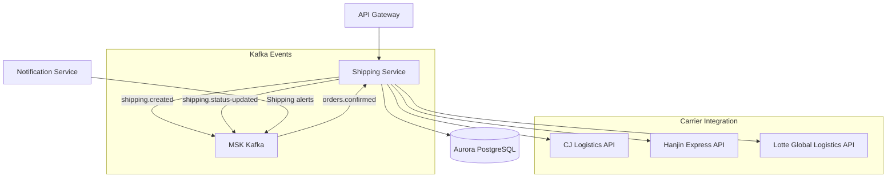
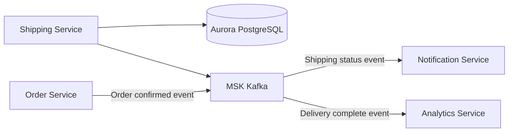

# Shipping Service

## Overview

The Shipping Service handles shipment creation, tracking, and status management for ordered products. It integrates with major Korean carriers (CJ Logistics, Hanjin Express, Lotte Global Logistics) to provide real-time shipment tracking.

| Item | Value |
|------|-------|
| Language | Python 3.11 |
| Framework | FastAPI |
| Database | Aurora PostgreSQL |
| Namespace | `mall-services` |
| Port | 8000 |
| Health Check | `GET /health` |

## Architecture



## API Endpoints

### Shipping API

| Method | Path | Description |
|--------|------|-------------|
| `GET` | `/api/v1/shipments/{order_id}` | Get shipment by order |
| `POST` | `/api/v1/shipments` | Create shipment |
| `PUT` | `/api/v1/shipments/{shipment_id}/status` | Update shipment status |
| `GET` | `/api/v1/shipments/{shipment_id}/tracking` | Get tracking history |

### Request/Response Examples

#### Get Shipment by Order

**Request:**
```http
GET /api/v1/shipments/order_001
```

**Response:**
```json
{
  "id": "ship_001",
  "order_id": "order_001",
  "user_id": "user_001",
  "shipping_address": "123 Teheran-ro, Gangnam-gu, Seoul, Apt 456",
  "carrier": "CJ Logistics",
  "tracking_number": "1234567890123",
  "status": "IN_TRANSIT",
  "tracking_history": [
    {
      "status": "PENDING",
      "location": null,
      "description": "Preparing for shipment",
      "timestamp": "2024-01-15T10:00:00Z"
    },
    {
      "status": "PICKED_UP",
      "location": "Seoul Songpa Distribution Center",
      "description": "Package picked up",
      "timestamp": "2024-01-15T14:00:00Z"
    },
    {
      "status": "IN_TRANSIT",
      "location": "Daejeon Hub Terminal",
      "description": "In transit",
      "timestamp": "2024-01-16T08:00:00Z"
    }
  ],
  "created_at": "2024-01-15T10:00:00Z",
  "updated_at": "2024-01-16T08:00:00Z"
}
```

#### Create Shipment

**Request:**
```http
POST /api/v1/shipments
Content-Type: application/json

{
  "order_id": "order_002",
  "user_id": "user_002",
  "shipping_address": "456 Centum-ro, Haeundae-gu, Busan",
  "carrier": "Hanjin Express"
}
```

**Response (201 Created):**
```json
{
  "id": "ship_002",
  "order_id": "order_002",
  "user_id": "user_002",
  "shipping_address": "456 Centum-ro, Haeundae-gu, Busan",
  "carrier": "Hanjin Express",
  "tracking_number": "9876543210987",
  "status": "PENDING",
  "tracking_history": [
    {
      "status": "PENDING",
      "location": null,
      "description": "Preparing for shipment",
      "timestamp": "2024-01-16T09:00:00Z"
    }
  ],
  "created_at": "2024-01-16T09:00:00Z",
  "updated_at": "2024-01-16T09:00:00Z"
}
```

#### Update Shipment Status

**Request:**
```http
PUT /api/v1/shipments/ship_002/status
Content-Type: application/json

{
  "status": "OUT_FOR_DELIVERY",
  "location": "Busan Haeundae Delivery Center",
  "description": "Out for delivery"
}
```

**Response:**
```json
{
  "id": "ship_002",
  "order_id": "order_002",
  "user_id": "user_002",
  "shipping_address": "456 Centum-ro, Haeundae-gu, Busan",
  "carrier": "Hanjin Express",
  "tracking_number": "9876543210987",
  "status": "OUT_FOR_DELIVERY",
  "tracking_history": [
    {
      "status": "PENDING",
      "location": null,
      "description": "Preparing for shipment",
      "timestamp": "2024-01-16T09:00:00Z"
    },
    {
      "status": "OUT_FOR_DELIVERY",
      "location": "Busan Haeundae Delivery Center",
      "description": "Out for delivery",
      "timestamp": "2024-01-17T08:30:00Z"
    }
  ],
  "created_at": "2024-01-16T09:00:00Z",
  "updated_at": "2024-01-17T08:30:00Z"
}
```

#### Get Tracking History

**Request:**
```http
GET /api/v1/shipments/ship_001/tracking
```

**Response:**
```json
[
  {
    "status": "PENDING",
    "location": null,
    "description": "Preparing for shipment",
    "timestamp": "2024-01-15T10:00:00Z"
  },
  {
    "status": "PICKED_UP",
    "location": "Seoul Songpa Distribution Center",
    "description": "Package picked up",
    "timestamp": "2024-01-15T14:00:00Z"
  },
  {
    "status": "IN_TRANSIT",
    "location": "Daejeon Hub Terminal",
    "description": "In transit",
    "timestamp": "2024-01-16T08:00:00Z"
  },
  {
    "status": "DELIVERED",
    "location": "Seoul Gangnam-gu",
    "description": "Delivered",
    "timestamp": "2024-01-16T14:00:00Z"
  }
]
```

## Data Models

### ShipmentStatus (Enum)

```python
class ShipmentStatus(str, Enum):
    PENDING = "PENDING"           # Preparing for shipment
    PICKED_UP = "PICKED_UP"       # Package picked up
    IN_TRANSIT = "IN_TRANSIT"     # In transit
    OUT_FOR_DELIVERY = "OUT_FOR_DELIVERY"  # Out for delivery
    DELIVERED = "DELIVERED"       # Delivered
```

### Shipment

```python
class Shipment(BaseModel):
    id: Optional[str] = None
    order_id: str
    user_id: str
    shipping_address: str
    carrier: Optional[str] = None
    tracking_number: Optional[str] = None
    status: ShipmentStatus = ShipmentStatus.PENDING
    tracking_history: list[TrackingEvent] = []
    created_at: datetime
    updated_at: datetime
```

### TrackingEvent

```python
class TrackingEvent(BaseModel):
    status: ShipmentStatus
    location: Optional[str] = None
    description: Optional[str] = None
    timestamp: datetime
```

### ShipmentCreate

```python
class ShipmentCreate(BaseModel):
    order_id: str
    user_id: str
    shipping_address: str
    carrier: Optional[str] = None
```

### PostgreSQL Table Schema

```sql
CREATE TABLE shipments (
    id UUID PRIMARY KEY DEFAULT gen_random_uuid(),
    order_id VARCHAR(50) NOT NULL UNIQUE,
    user_id VARCHAR(50) NOT NULL,
    shipping_address TEXT NOT NULL,
    carrier VARCHAR(50),
    tracking_number VARCHAR(50),
    status VARCHAR(20) NOT NULL DEFAULT 'PENDING',
    created_at TIMESTAMP WITH TIME ZONE DEFAULT NOW(),
    updated_at TIMESTAMP WITH TIME ZONE DEFAULT NOW()
);

CREATE TABLE tracking_events (
    id UUID PRIMARY KEY DEFAULT gen_random_uuid(),
    shipment_id UUID REFERENCES shipments(id),
    status VARCHAR(20) NOT NULL,
    location VARCHAR(200),
    description TEXT,
    timestamp TIMESTAMP WITH TIME ZONE DEFAULT NOW()
);

CREATE INDEX idx_shipments_order_id ON shipments(order_id);
CREATE INDEX idx_shipments_user_id ON shipments(user_id);
CREATE INDEX idx_tracking_events_shipment_id ON tracking_events(shipment_id);
```

## Events (Kafka)

### Subscribed Topics

| Topic | Event | Description |
|-------|-------|-------------|
| `orders.confirmed` | Order confirmed | Triggers shipment creation after inventory secured |

### Published Topics

| Topic | Event | Description |
|-------|-------|-------------|
| `shipping.created` | Shipment created | Published when shipment is created |
| `shipping.status-updated` | Status changed | Published when shipment status changes |
| `shipping.delivered` | Delivered | Published when delivery is complete |

### Event Payload Examples

**orders.confirmed (subscribed):**
```json
{
  "event_type": "order.confirmed",
  "order_id": "order_001",
  "user_id": "user_001",
  "shipping_address": "123 Teheran-ro, Gangnam-gu, Seoul",
  "items": [
    {"product_id": "prod_001", "quantity": 2}
  ],
  "timestamp": "2024-01-15T10:00:00Z"
}
```

**shipping.status-updated (published):**
```json
{
  "event_type": "shipping.status-updated",
  "shipment_id": "ship_001",
  "order_id": "order_001",
  "user_id": "user_001",
  "status": "OUT_FOR_DELIVERY",
  "carrier": "CJ Logistics",
  "tracking_number": "1234567890123",
  "timestamp": "2024-01-16T08:30:00Z"
}
```

## Environment Variables

| Variable | Description | Default |
|----------|-------------|---------|
| `SERVICE_NAME` | Service name | `shipping` |
| `PORT` | Service port | `8080` |
| `AWS_REGION` | AWS region | `us-east-1` |
| `REGION_ROLE` | Region role (PRIMARY/SECONDARY) | `PRIMARY` |
| `DB_HOST` | Aurora PostgreSQL host | `localhost` |
| `DB_PORT` | Aurora PostgreSQL port | `5432` |
| `DB_NAME` | Database name | `shipping` |
| `DB_USER` | Database user | `mall` |
| `DB_PASSWORD` | Database password | - |
| `KAFKA_BROKERS` | Kafka broker address | `localhost:9092` |
| `LOG_LEVEL` | Log level | `info` |

## Service Dependencies



### Services It Depends On
- **Aurora PostgreSQL**: Shipment data storage
- **MSK Kafka**: Event publishing/subscription
- **Order Service**: Receives `orders.confirmed` events

### Services That Depend On This
- **Notification Service**: Shipping status notifications
- **Analytics Service**: Shipping dashboard
- **Order Service**: Order status update on delivery completion

## Carrier Integration

### Supported Carriers

| Carrier | Code | API Integration |
|---------|------|-----------------|
| CJ Logistics | `CJ` | Real-time tracking |
| Hanjin Express | `HANJIN` | Real-time tracking |
| Lotte Global Logistics | `LOTTE` | Real-time tracking |

### Status Mapping

| Status | CJ Logistics | Hanjin Express | Lotte Global |
|--------|--------------|----------------|--------------|
| PENDING | Received | Order Received | Received |
| PICKED_UP | Picked Up | Package Picked Up | Collection |
| IN_TRANSIT | In Transit | In Transit | Linehaul |
| OUT_FOR_DELIVERY | Out for Delivery | Out for Delivery | Out for Delivery |
| DELIVERED | Delivered | Delivered | Delivered |
