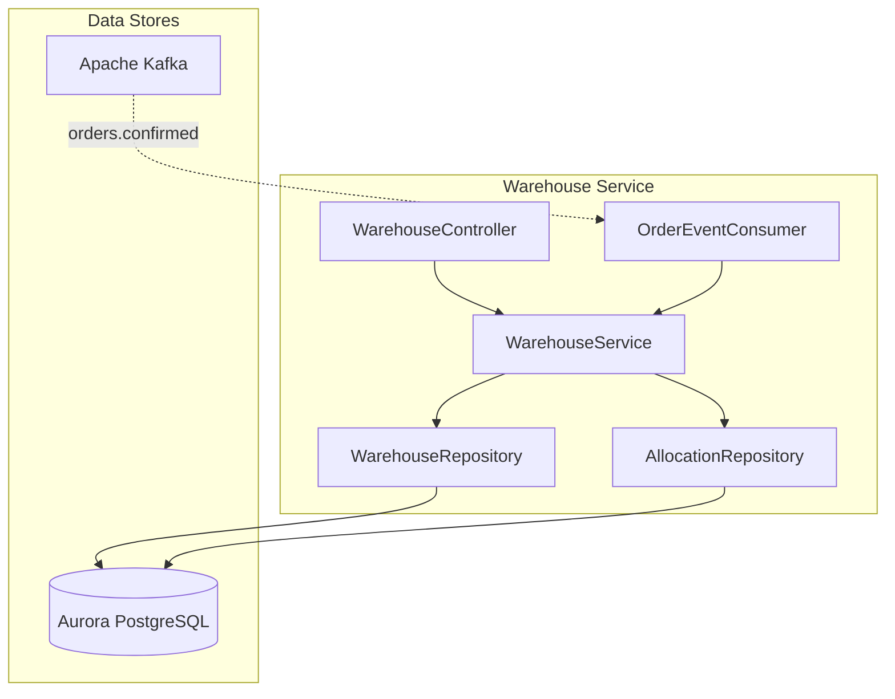
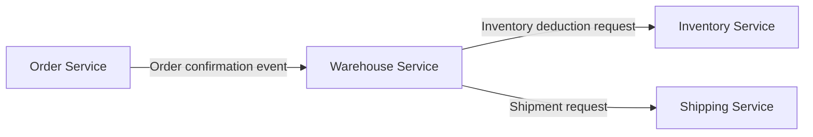
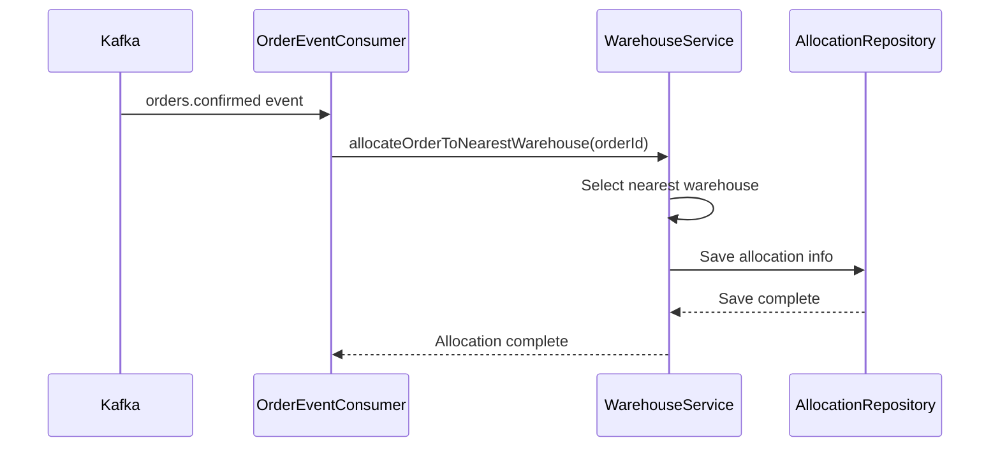
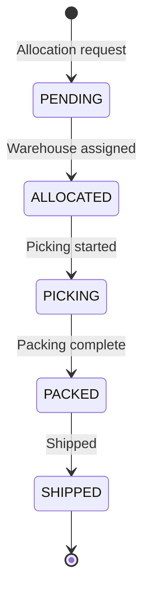

# Warehouse Service

## Overview

The Warehouse Service handles warehouse management, inventory allocation, and inventory tracking for order fulfillment. It receives order confirmation events and automatically allocates inventory to the nearest warehouse.

| Item | Details |
|------|---------|
| Language | Java 17 |
| Framework | Spring Boot 3.2 |
| Database | Aurora PostgreSQL (Global Database) |
| Namespace | `mall-warehouse` |
| Port | 8080 |
| Health Check | `/actuator/health` |

## Architecture



## API Endpoints

| Method | Path | Description |
|--------|------|-------------|
| `GET` | `/api/v1/warehouses` | Get warehouse list |
| `GET` | `/api/v1/warehouses/{id}` | Get warehouse details |
| `POST` | `/api/v1/warehouses/{id}/allocate` | Allocate order |
| `GET` | `/api/v1/warehouses/{id}/inventory` | Get warehouse inventory status |

### Get Warehouse List

**GET** `/api/v1/warehouses`

Response (200 OK):
```json
[
  {
    "id": "550e8400-e29b-41d4-a716-446655440000",
    "name": "Seoul Distribution Center",
    "location": "Gangnam-gu, Seoul",
    "capacity": 10000,
    "active": true,
    "createdAt": "2024-01-01T00:00:00"
  },
  {
    "id": "550e8400-e29b-41d4-a716-446655440001",
    "name": "Busan Distribution Center",
    "location": "Haeundae-gu, Busan",
    "capacity": 8000,
    "active": true,
    "createdAt": "2024-01-01T00:00:00"
  }
]
```

### Get Warehouse Details

**GET** `/api/v1/warehouses/{id}`

Response (200 OK):
```json
{
  "id": "550e8400-e29b-41d4-a716-446655440000",
  "name": "Seoul Distribution Center",
  "location": "Gangnam-gu, Seoul",
  "capacity": 10000,
  "active": true,
  "createdAt": "2024-01-01T00:00:00"
}
```

### Allocate Order

**POST** `/api/v1/warehouses/{id}/allocate`

Request:
```json
{
  "orderId": "660e8400-e29b-41d4-a716-446655440000"
}
```

Response (200 OK):
```json
{
  "id": "770e8400-e29b-41d4-a716-446655440000",
  "warehouseId": "550e8400-e29b-41d4-a716-446655440000",
  "warehouseName": "Seoul Distribution Center",
  "orderId": "660e8400-e29b-41d4-a716-446655440000",
  "status": "ALLOCATED",
  "createdAt": "2024-01-15T10:35:00",
  "updatedAt": "2024-01-15T10:35:00"
}
```

### Get Warehouse Inventory Status

**GET** `/api/v1/warehouses/{id}/inventory`

Response (200 OK):
```json
{
  "warehouseId": "550e8400-e29b-41d4-a716-446655440000",
  "warehouseName": "Seoul Distribution Center",
  "totalCapacity": 10000,
  "activeAllocations": 150,
  "availableCapacity": 9850
}
```

## Data Models

### Warehouse Entity

```java
@Entity
@Table(name = "warehouses")
public class Warehouse {
    @Id
    @GeneratedValue(strategy = GenerationType.UUID)
    private UUID id;

    @Column(nullable = false)
    private String name;

    private String location;

    @Column(columnDefinition = "INTEGER DEFAULT 0")
    private Integer capacity = 0;

    @Column(columnDefinition = "BOOLEAN DEFAULT true")
    private Boolean active = true;

    @Column(name = "created_at")
    private LocalDateTime createdAt;
}
```

### Allocation Entity

```java
@Entity
@Table(name = "allocations")
public class Allocation {
    @Id
    @GeneratedValue(strategy = GenerationType.UUID)
    private UUID id;

    @ManyToOne
    @JoinColumn(name = "warehouse_id")
    private Warehouse warehouse;

    @Column(name = "order_id", nullable = false)
    private UUID orderId;

    @Enumerated(EnumType.STRING)
    @Column(length = 50)
    private AllocationStatus status = AllocationStatus.PENDING;

    @Column(name = "created_at")
    private LocalDateTime createdAt;

    @Column(name = "updated_at")
    private LocalDateTime updatedAt;
}
```

### AllocationStatus Enum

```java
public enum AllocationStatus {
    PENDING,    // Pending
    ALLOCATED,  // Allocated
    PICKING,    // Picking in progress
    PACKED,     // Packing complete
    SHIPPED     // Shipped
}
```

### Database Schema

```sql
CREATE TABLE warehouses (
    id UUID PRIMARY KEY DEFAULT gen_random_uuid(),
    name VARCHAR(255) NOT NULL,
    location VARCHAR(255),
    capacity INTEGER DEFAULT 0,
    active BOOLEAN DEFAULT true,
    created_at TIMESTAMP DEFAULT CURRENT_TIMESTAMP
);

CREATE TABLE allocations (
    id UUID PRIMARY KEY DEFAULT gen_random_uuid(),
    warehouse_id UUID REFERENCES warehouses(id),
    order_id UUID NOT NULL,
    status VARCHAR(50) DEFAULT 'PENDING',
    created_at TIMESTAMP DEFAULT CURRENT_TIMESTAMP,
    updated_at TIMESTAMP DEFAULT CURRENT_TIMESTAMP
);

CREATE INDEX idx_allocations_warehouse_id ON allocations(warehouse_id);
CREATE INDEX idx_allocations_order_id ON allocations(order_id);
CREATE INDEX idx_allocations_status ON allocations(status);
```

## Events (Kafka)

### Subscribed Topics

| Topic Name | Description |
|------------|-------------|
| `orders.confirmed` | Receives order confirmation events for automatic allocation |

#### orders.confirmed Processing

```java
@KafkaListener(topics = "orders.confirmed", groupId = "warehouse-service")
public void handleOrderConfirmed(Map<String, Object> orderData) {
    UUID orderId = UUID.fromString(orderData.get("order_id").toString());
    warehouseService.allocateOrderToNearestWarehouse(orderId);
}
```

Received payload:
```json
{
  "event": "order.confirmed",
  "order_id": "660e8400-e29b-41d4-a716-446655440000",
  "user_id": "user-123",
  "total_amount": 687000.00
}
```

## Environment Variables

| Variable | Description | Default |
|----------|-------------|---------|
| `SPRING_DATASOURCE_URL` | Aurora PostgreSQL connection URL | - |
| `SPRING_DATASOURCE_USERNAME` | DB username | - |
| `SPRING_DATASOURCE_PASSWORD` | DB password | - |
| `SPRING_KAFKA_BOOTSTRAP_SERVERS` | Kafka broker address | - |
| `SPRING_KAFKA_CONSUMER_GROUP_ID` | Kafka consumer group ID | warehouse-service |
| `SERVER_PORT` | Service port | 8080 |

## Service Dependencies



### Automatic Allocation Process



### Allocation Status Flow



### Error Handling

| HTTP Status Code | Error | Description |
|------------------|-------|-------------|
| 404 | WarehouseNotFoundException | Warehouse not found |
| 400 | IllegalStateException | Cannot allocate (inactive warehouse, etc.) |
| 400 | InsufficientCapacityException | Insufficient warehouse capacity |
