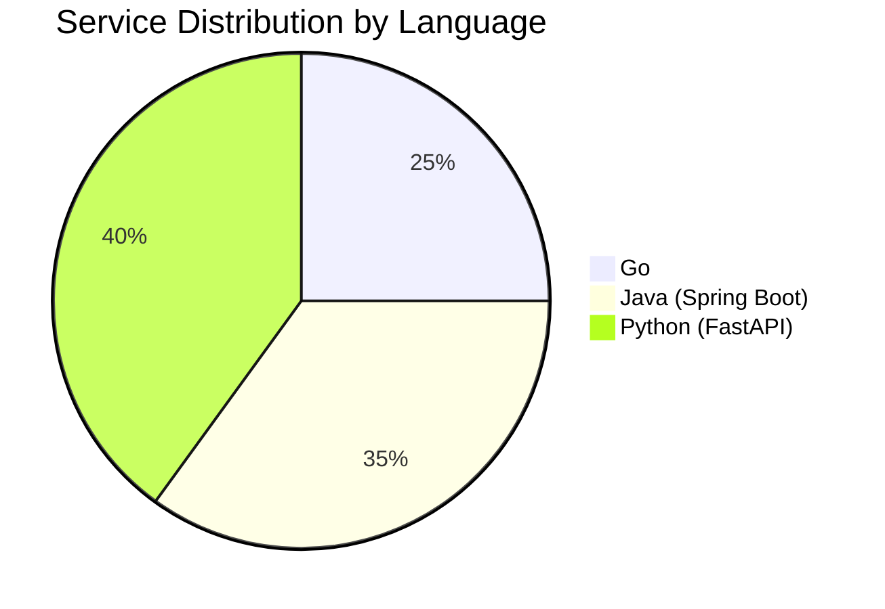

# Service Overview

The Multi-Region Shopping Mall platform consists of 20 microservices. Each service is responsible for a specific business domain and can be deployed and scaled independently.

## Service List

### Core Services

| Service | Language | Framework | Database | Port | Namespace |
|---------|----------|-----------|----------|------|-----------|
| API Gateway | Go | Gin | ElastiCache (Valkey) | 8080 | core-services |
| Product Catalog | Python | FastAPI | DocumentDB | 8080 | core-services |
| Search | Go | Gin | OpenSearch, DocumentDB | 8080 | core-services |
| Cart | Go | Gin | ElastiCache (Valkey) | 8080 | core-services |
| Order | Java | Spring Boot | Aurora PostgreSQL | 8080 | core-services |
| Payment | Java | Spring Boot | Aurora PostgreSQL | 8080 | core-services |
| Inventory | Go | Gin | Aurora PostgreSQL | 8080 | core-services |

### User Services

| Service | Language | Framework | Database | Port | Namespace |
|---------|----------|-----------|----------|------|-----------|
| User Account | Java | Spring Boot | Aurora PostgreSQL | 8080 | user-services |
| User Profile | Python | FastAPI | DocumentDB | 8080 | user-services |
| Wishlist | Python | FastAPI | DocumentDB | 8080 | user-services |
| Review | Python | FastAPI | DocumentDB | 8080 | user-services |

### Fulfillment Services

| Service | Language | Framework | Database | Port | Namespace |
|---------|----------|-----------|----------|------|-----------|
| Shipping | Python | FastAPI | DocumentDB | 8080 | fulfillment |
| Warehouse | Java | Spring Boot | Aurora PostgreSQL | 8080 | fulfillment |
| Returns | Java | Spring Boot | Aurora PostgreSQL | 8080 | fulfillment |

### Business Services

| Service | Language | Framework | Database | Port | Namespace |
|---------|----------|-----------|----------|------|-----------|
| Pricing | Java | Spring Boot | Aurora PostgreSQL | 8080 | business-services |
| Recommendation | Python | FastAPI | DocumentDB, ElastiCache | 8080 | business-services |
| Notification | Python | FastAPI | DocumentDB | 8080 | business-services |
| Seller | Java | Spring Boot | Aurora PostgreSQL | 8080 | business-services |

### Platform Services

| Service | Language | Framework | Database | Port | Namespace |
|---------|----------|-----------|----------|------|-----------|
| Event Bus | Go | Gin | MSK (Kafka) | 8080 | platform |
| Analytics | Python | FastAPI | OpenSearch | 8080 | platform |

## Technology Stack Distribution

## Service Dependency Diagram

```mermaid
flowchart TB
    subgraph External["External Clients"]
        Client[Web/Mobile Clients]
    end

    subgraph Gateway["API Layer"]
        APIGateway[API Gateway]
    end

    subgraph Core["Core Services"]
        ProductCatalog[Product Catalog]
        Search[Search]
        Cart[Cart]
        Order[Order]
        Payment[Payment]
        Inventory[Inventory]
    end

    subgraph User["User Services"]
        UserAccount[User Account]
        UserProfile[User Profile]
        Wishlist[Wishlist]
        Review[Review]
    end

    subgraph Fulfillment["Fulfillment Services"]
        Shipping[Shipping]
        Warehouse[Warehouse]
        Returns[Returns]
    end

    subgraph Business["Business Services"]
        Pricing[Pricing]
        Recommendation[Recommendation]
        Notification[Notification]
        Seller[Seller]
    end

    subgraph Platform["Platform Services"]
        EventBus[Event Bus]
        Analytics[Analytics]
    end

    subgraph Data["Data Layer"]
        Aurora[(Aurora PostgreSQL)]
        DocumentDB[(DocumentDB)]
        ElastiCache[(ElastiCache Valkey)]
        OpenSearch[(OpenSearch)]
        MSK[(MSK Kafka)]
    end

    Client --> APIGateway

    APIGateway --> ProductCatalog
    APIGateway --> Search
    APIGateway --> Cart
    APIGateway --> Order
    APIGateway --> Payment
    APIGateway --> Inventory
    APIGateway --> UserAccount
    APIGateway --> UserProfile
    APIGateway --> Wishlist
    APIGateway --> Review
    APIGateway --> Shipping
    APIGateway --> Warehouse
    APIGateway --> Returns
    APIGateway --> Pricing
    APIGateway --> Recommendation
    APIGateway --> Notification
    APIGateway --> Seller
    APIGateway --> EventBus
    APIGateway --> Analytics

    %% Core Service Dependencies
    Search --> OpenSearch
    Search --> DocumentDB
    Cart --> ElastiCache
    Order --> Aurora
    Order --> EventBus
    Payment --> Aurora
    Payment --> EventBus
    Inventory --> Aurora
    Inventory --> EventBus

    %% User Service Dependencies
    UserAccount --> Aurora
    UserProfile --> DocumentDB
    Wishlist --> DocumentDB
    Review --> DocumentDB

    %% Fulfillment Dependencies
    Shipping --> DocumentDB
    Warehouse --> Aurora
    Returns --> Aurora

    %% Business Dependencies
    Pricing --> Aurora
    Recommendation --> DocumentDB
    Recommendation --> ElastiCache
    Notification --> DocumentDB
    Seller --> Aurora

    %% Platform Dependencies
    EventBus --> MSK
    Analytics --> OpenSearch

    %% Event-driven connections
    ProductCatalog -.->|Event| EventBus
    Order -.->|Event| EventBus
    Payment -.->|Event| EventBus
    Inventory -.->|Event| EventBus
    EventBus -.->|Event| Search
    EventBus -.->|Event| Notification
    EventBus -.->|Event| Analytics
```

## Regional Deployment Configuration

| Region | Role | Characteristics |
|--------|------|-----------------|
| us-east-1 | Primary | Handles write operations, Global Database Primary |
| us-west-2 | Secondary | Handles read operations, write requests forwarded to Primary |

### Multi-Region Data Replication

- **Aurora Global Database**: Less than 1 second replication lag from Primary to Secondary
- **DocumentDB Global Cluster**: Data synchronization through change streams
- **ElastiCache Global Datastore**: Session and cache replication across regions
- **MSK**: Independent clusters per region (events processed locally)

## API Path Mapping

The API Gateway routes all requests to appropriate backend services:

| API Path | Backend Service |
|----------|-----------------|
| `/api/v1/products` | product-catalog.core-services |
| `/api/v1/search` | search.core-services |
| `/api/v1/cart` | cart.core-services |
| `/api/v1/orders` | order.core-services |
| `/api/v1/payments` | payment.core-services |
| `/api/v1/inventory` | inventory.core-services |
| `/api/v1/auth` | user-account.user-services |
| `/api/v1/profiles` | user-profile.user-services |
| `/api/v1/wishlists` | wishlist.user-services |
| `/api/v1/reviews` | review.user-services |
| `/api/v1/shipments` | shipping.fulfillment |
| `/api/v1/warehouses` | warehouse.fulfillment |
| `/api/v1/returns` | returns.fulfillment |
| `/api/v1/pricing` | pricing.business-services |
| `/api/v1/recommendations` | recommendation.business-services |
| `/api/v1/notifications` | notification.business-services |
| `/api/v1/sellers` | seller.business-services |
| `/api/v1/events` | event-bus.platform |
| `/api/v1/analytics` | analytics.platform |

## Common Features

All services provide the following common features:

### Health Check Endpoints
- `GET /healthz` - Liveness probe
- `GET /readyz` - Readiness probe

### Observability
- **Distributed Tracing**: Tempo/X-Ray integration via OpenTelemetry
- **Metrics**: Prometheus format metrics exposure
- **Logging**: Structured JSON logging

### Region-Aware Middleware
- Automatic forwarding to Primary for write requests in Secondary region
- Region information propagation via `X-Region` header
