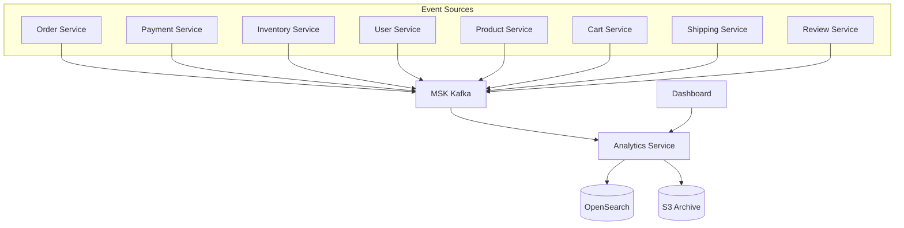
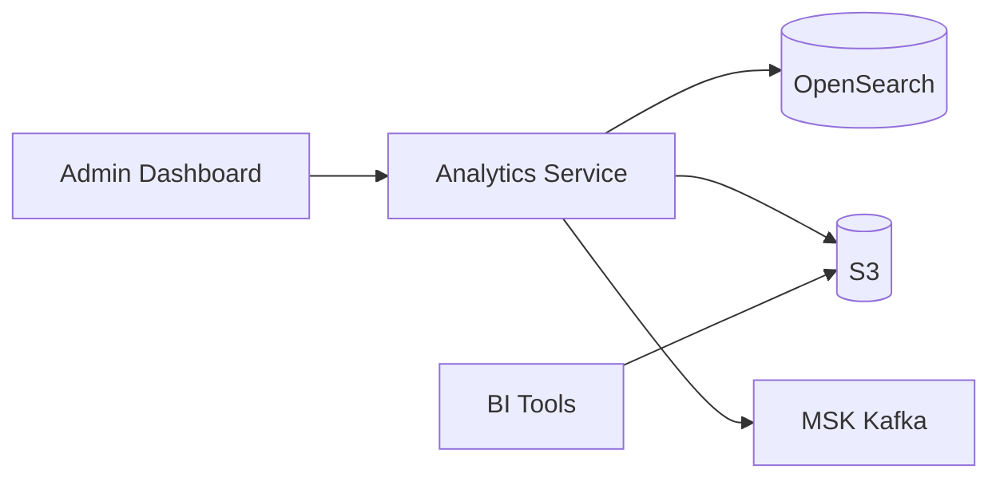

# Analytics Service

## Overview

The Analytics Service collects and analyzes all domain events from the shopping mall. It stores events in OpenSearch to provide real-time dashboards and custom queries, and archives events to S3.

| Item | Value |
|------|-------|
| Language | Python 3.11 |
| Framework | FastAPI |
| Search/Analytics | OpenSearch |
| Archive | S3 |
| Namespace | `mall-services` |
| Port | 8000 |
| Health Check | `GET /health` |

## Architecture



## API Endpoints

### Analytics API

| Method | Path | Description |
|--------|------|-------------|
| `GET` | `/api/v1/analytics/dashboard` | Dashboard metrics |
| `GET` | `/api/v1/analytics/events` | Get event list |
| `POST` | `/api/v1/analytics/query` | Execute custom query |

### Request/Response Examples

#### Dashboard Metrics

**Request:**
```http
GET /api/v1/analytics/dashboard
```

**Response:**
```json
{
  "order_count": 15420,
  "revenue": 2456780000,
  "active_users": 8934,
  "events_processed": 1523456,
  "events_by_topic": {
    "orders": 45230,
    "payments": 43120,
    "inventory": 89450,
    "users": 12340,
    "products": 8920,
    "cart": 234560,
    "shipping": 41230,
    "reviews": 15670,
    "notifications": 52340,
    "pricing": 3450,
    "recommendations": 98760
  },
  "last_updated": "2024-01-15T10:00:00Z"
}
```

#### Get Event List

**Request:**
```http
GET /api/v1/analytics/events?topic=orders&start_time=2024-01-15T00:00:00Z&end_time=2024-01-15T23:59:59Z&limit=100
```

**Response:**
```json
[
  {
    "id": "evt_001",
    "topic": "orders",
    "key": "order_001",
    "payload": {
      "event_type": "order.created",
      "order_id": "order_001",
      "user_id": "user_001",
      "total_amount": 159000,
      "items": [
        {"product_id": "prod_001", "quantity": 2, "price": 79500}
      ]
    },
    "timestamp": "2024-01-15T10:30:00Z",
    "region": "us-east-1"
  },
  {
    "id": "evt_002",
    "topic": "orders",
    "key": "order_001",
    "payload": {
      "event_type": "order.confirmed",
      "order_id": "order_001",
      "user_id": "user_001"
    },
    "timestamp": "2024-01-15T10:35:00Z",
    "region": "us-east-1"
  }
]
```

#### Execute Custom Query

**Request:**
```http
POST /api/v1/analytics/query
Content-Type: application/json

{
  "query_type": "sum",
  "topic": "orders",
  "field": "payload.total_amount",
  "start_time": "2024-01-01T00:00:00Z",
  "end_time": "2024-01-31T23:59:59Z",
  "group_by": "payload.user_id",
  "limit": 10
}
```

**Response:**
```json
{
  "query_type": "sum",
  "result": [
    {"user_id": "user_001", "total_amount": 2345000},
    {"user_id": "user_042", "total_amount": 1890000},
    {"user_id": "user_015", "total_amount": 1567000}
  ],
  "count": 10,
  "execution_time_ms": 45.2
}
```

## Data Models

### DashboardMetrics

```python
class DashboardMetrics(BaseModel):
    order_count: int = Field(description="Total number of orders")
    revenue: float = Field(description="Total revenue")
    active_users: int = Field(description="Number of active users")
    events_processed: int = Field(description="Total events processed")
    events_by_topic: dict[str, int] = Field(description="Event counts by topic")
    last_updated: datetime
```

### EventRecord

```python
class EventRecord(BaseModel):
    id: str
    topic: str
    key: Optional[str] = None
    payload: dict[str, Any]
    timestamp: datetime
    region: Optional[str] = None
```

### AnalyticsQuery

```python
class AnalyticsQuery(BaseModel):
    query_type: str = Field(description="Type of query: count, sum, avg, list")
    topic: Optional[str] = Field(None, description="Filter by topic")
    field: Optional[str] = Field(None, description="Field to aggregate on")
    start_time: Optional[datetime] = Field(None, description="Start of time range")
    end_time: Optional[datetime] = Field(None, description="End of time range")
    group_by: Optional[str] = Field(None, description="Field to group results by")
    limit: int = Field(100, ge=1, le=10000, description="Maximum results")
```

### QueryResult

```python
class QueryResult(BaseModel):
    query_type: str
    result: Any
    count: int
    execution_time_ms: float
```

## Events (Kafka)

### Subscribed Topics

The Analytics Service subscribes to all events from these 12 topics:

| Topic | Description | Key Events |
|-------|-------------|------------|
| `orders` | Order events | created, confirmed, cancelled |
| `payments` | Payment events | completed, failed, refunded |
| `inventory` | Inventory events | reserved, released, updated |
| `users` | User events | registered, updated, deleted |
| `products` | Product events | created, updated, deleted |
| `cart` | Cart events | item-added, item-removed, cleared |
| `shipping` | Shipping events | created, status-updated, delivered |
| `notifications` | Notification events | sent, failed |
| `reviews` | Review events | created, updated, deleted |
| `pricing` | Pricing events | updated, promotion-applied |
| `analytics` | Analytics events | page-view, click, search |
| `recommendations` | Recommendation events | generated, clicked |

### Consumer Configuration

```python
TOPICS = [
    "orders", "payments", "inventory", "users", "products",
    "cart", "shipping", "notifications", "reviews",
    "pricing", "analytics", "recommendations"
]

consumer = AIOKafkaConsumer(
    *TOPICS,
    bootstrap_servers=config.kafka_brokers,
    group_id=f"analytics-{config.aws_region}",
    auto_offset_reset="earliest",
    enable_auto_commit=True
)
```

## OpenSearch Index

### Index Mapping

```json
{
  "mappings": {
    "properties": {
      "id": { "type": "keyword" },
      "topic": { "type": "keyword" },
      "key": { "type": "keyword" },
      "payload": { "type": "object", "enabled": true },
      "timestamp": { "type": "date" },
      "region": { "type": "keyword" }
    }
  },
  "settings": {
    "number_of_shards": 5,
    "number_of_replicas": 1
  }
}
```

### Index Pattern

- Daily index: `events-YYYY-MM-DD`
- Index alias: `events` (rolling 30 days)

## S3 Archiving

### Archive Structure

```
s3://{bucket}/events/
  ├── year=2024/
  │   ├── month=01/
  │   │   ├── day=15/
  │   │   │   ├── hour=00/
  │   │   │   │   ├── events_00000.parquet
  │   │   │   │   └── events_00001.parquet
  │   │   │   └── hour=01/
  │   │   │       └── ...
```

### Flush Settings

```python
class AnalyticsConfig(ServiceConfig):
    s3_bucket: str = ""
    s3_prefix: str = "events/"
    flush_interval_seconds: int = 60    # Flush every minute
    flush_batch_size: int = 1000        # Flush every 1000 events
```

## Environment Variables

| Variable | Description | Default |
|----------|-------------|---------|
| `SERVICE_NAME` | Service name | `analytics` |
| `PORT` | Service port | `8080` |
| `AWS_REGION` | AWS region | `us-east-1` |
| `REGION_ROLE` | Region role (PRIMARY/SECONDARY) | `PRIMARY` |
| `KAFKA_BROKERS` | Kafka broker address | `localhost:9092` |
| `OPENSEARCH_ENDPOINT` | OpenSearch endpoint | `http://localhost:9200` |
| `S3_BUCKET` | S3 archive bucket | - |
| `S3_PREFIX` | S3 archive path prefix | `events/` |
| `FLUSH_INTERVAL_SECONDS` | S3 flush interval (seconds) | `60` |
| `FLUSH_BATCH_SIZE` | S3 flush batch size | `1000` |
| `LOG_LEVEL` | Log level | `info` |

## Service Dependencies



### Services It Depends On
- **MSK Kafka**: Subscribe to all domain events
- **OpenSearch**: Real-time event search and aggregation
- **S3**: Long-term event archiving

### Services That Depend On This
- **Admin Dashboard**: Real-time metrics lookup
- **BI Tools**: S3 archive data analysis

## Feature Details

### Real-time Dashboard

| Metric | Description | Update Frequency |
|--------|-------------|------------------|
| Order Count | Total order count | Real-time |
| Revenue | Total payment amount | Real-time |
| Active Users | Users active in last 30 minutes | 1 minute |
| Event Throughput | Events processed per second | Real-time |

### Query Types

| Type | Description | Use Case |
|------|-------------|----------|
| `count` | Event count aggregation | Daily order count |
| `sum` | Field sum | Total revenue |
| `avg` | Field average | Average order amount |
| `list` | Event list | Recent order history |

### Data Retention Policy

| Storage | Retention Period | Purpose |
|---------|------------------|---------|
| OpenSearch | 30 days | Real-time analytics |
| S3 (Standard) | 90 days | Recent analysis |
| S3 (Glacier) | 7 years | Long-term retention |
