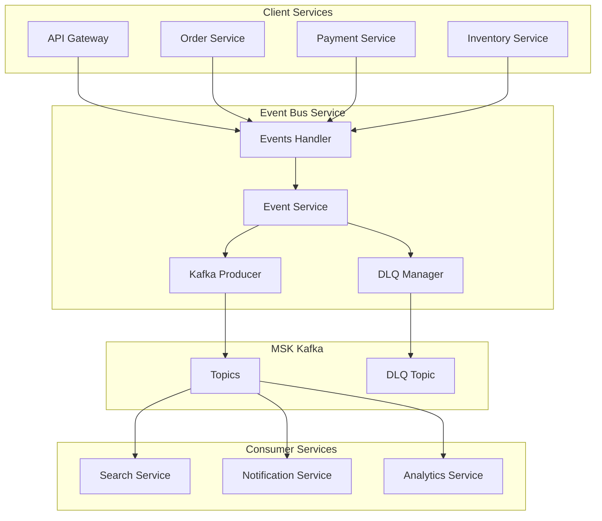
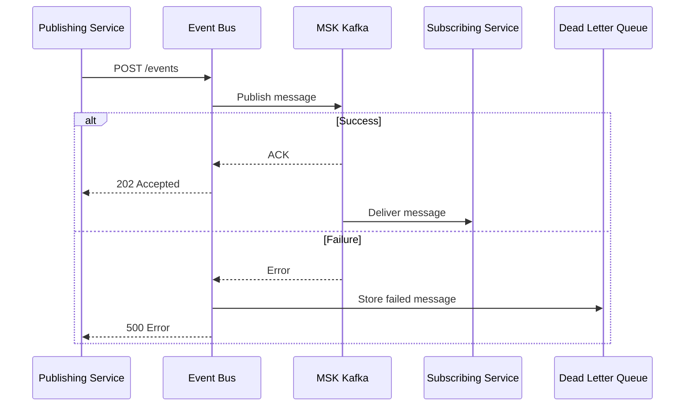
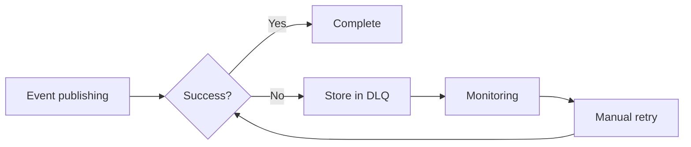
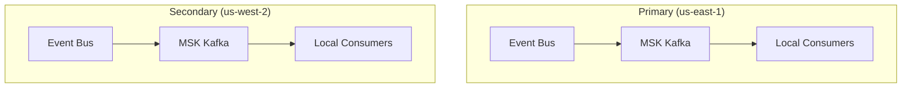

# Event Bus Service

## Overview

The Event Bus Service provides event publishing and management functionality through MSK (Kafka). It serves as the central event hub for asynchronous communication between services and includes DLQ (Dead Letter Queue) management functionality.

| Item | Details |
|------|---------|
| Language | Go 1.21+ |
| Framework | Gin |
| Message Broker | MSK (Kafka) |
| Namespace | platform |
| Port | 8080 |
| Health Check | `/healthz`, `/readyz` |

## Architecture



## Key Features

### 1. Event Publishing
- Dynamic topic creation and message publishing
- Key-based partitioning
- At-least-once delivery guarantee

### 2. Topic Management
- Query available topic list
- Pre-defined topic set provided

### 3. DLQ Management
- Failed message retention
- Manual retry support
- Failure cause tracking

## API Endpoints

| Method | Path | Description |
|--------|------|-------------|
| POST | `/api/v1/events` | Publish event |
| GET | `/api/v1/events/topics` | Get topic list |
| GET | `/api/v1/events/dlq` | Get DLQ messages |
| POST | `/api/v1/events/dlq/:id/retry` | Retry DLQ message |

### Publish Event

#### Request

```bash
POST /api/v1/events
Content-Type: application/json

{
  "topic": "orders",
  "key": "order-12345",
  "payload": {
    "event_type": "order.created",
    "order_id": "order-12345",
    "user_id": "user-001",
    "items": [
      {
        "product_id": "prod-001",
        "quantity": 2,
        "price": 1590000
      }
    ],
    "total": 3180000,
    "created_at": "2024-01-15T10:30:00Z"
  }
}
```

#### Response (Success)

```json
{
  "id": "550e8400-e29b-41d4-a716-446655440000",
  "topic": "orders",
  "timestamp": "2024-01-15T10:30:00Z"
}
```
HTTP Status: 202 Accepted

#### Response (Failure)

```json
{
  "error": "failed to publish event"
}
```
HTTP Status: 500 Internal Server Error

### Get Topic List

#### Request

```bash
GET /api/v1/events/topics
```

#### Response

```json
{
  "topics": [
    "orders",
    "payments",
    "inventory",
    "users",
    "products",
    "cart",
    "shipping",
    "notifications",
    "reviews",
    "pricing",
    "analytics",
    "recommendations"
  ]
}
```

### Get DLQ Messages

#### Request

```bash
GET /api/v1/events/dlq
```

#### Response

```json
{
  "messages": [
    {
      "id": "550e8400-e29b-41d4-a716-446655440001",
      "topic": "orders",
      "key": "order-12346",
      "payload": {
        "event_type": "order.created",
        "order_id": "order-12346"
      },
      "error": "kafka: broker not available",
      "timestamp": "2024-01-15T10:35:00Z",
      "retry_count": 2
    }
  ],
  "count": 1
}
```

### Retry DLQ Message

#### Request

```bash
POST /api/v1/events/dlq/550e8400-e29b-41d4-a716-446655440001/retry
```

#### Response (Success)

```json
{
  "id": "550e8400-e29b-41d4-a716-446655440001",
  "topic": "orders",
  "retried": true,
  "timestamp": "2024-01-15T10:40:00Z"
}
```

#### Response (Message Not Found)

```json
{
  "error": "message not found"
}
```
HTTP Status: 404 Not Found

## Data Models

### Event

```go
type Event struct {
    ID         string      `json:"id"`
    Topic      string      `json:"topic"`
    Key        string      `json:"key"`
    Payload    interface{} `json:"payload"`
    Timestamp  time.Time   `json:"timestamp"`
    RetryCount int         `json:"retry_count"`
}
```

### DLQMessage

```go
type DLQMessage struct {
    ID         string      `json:"id"`
    Topic      string      `json:"topic"`
    Key        string      `json:"key"`
    Payload    interface{} `json:"payload"`
    Error      string      `json:"error"`
    Timestamp  time.Time   `json:"timestamp"`
    RetryCount int         `json:"retry_count"`
}
```

### PublishRequest

```go
type PublishRequest struct {
    Topic   string      `json:"topic" binding:"required"`
    Key     string      `json:"key"`
    Payload interface{} `json:"payload" binding:"required"`
}
```

## Available Topics

| Topic | Description | Primary Publisher |
|-------|-------------|-------------------|
| `orders` | Order events | Order Service |
| `payments` | Payment events | Payment Service |
| `inventory` | Inventory events | Inventory Service |
| `users` | User events | User Account Service |
| `products` | Product events | Product Catalog Service |
| `cart` | Cart events | Cart Service |
| `shipping` | Shipping events | Shipping Service |
| `notifications` | Notification events | Various services |
| `reviews` | Review events | Review Service |
| `pricing` | Pricing events | Pricing Service |
| `analytics` | Analytics events | Various services |
| `recommendations` | Recommendation events | Recommendation Service |

## Kafka Configuration

### Producer Settings

```go
type EventProducer struct {
    brokers string
    writers map[string]*kafka.Writer
    logger  *zap.Logger
}

// Writer settings
w := &kafka.Writer{
    Addr:         kafka.TCP(brokers...),
    Topic:        topic,
    Balancer:     &kafka.LeastBytes{},
    BatchTimeout: 10 * time.Millisecond,
    RequiredAcks: kafka.RequireAll,  // Confirm all replicas
}
```

### Message Format

```go
msg := kafka.Message{
    Key:   []byte(key),
    Value: data,  // JSON encoded
    Time:  time.Now(),
}
```

## Environment Variables

| Variable | Description | Default |
|----------|-------------|---------|
| `PORT` | Server port | `8080` |
| `AWS_REGION` | AWS region | `us-east-1` |
| `REGION_ROLE` | Region role (PRIMARY/SECONDARY) | `PRIMARY` |
| `PRIMARY_HOST` | Primary region host | - |
| `KAFKA_BROKERS` | Kafka broker address | `localhost:9092` |
| `LOG_LEVEL` | Log level | `info` |

## Service Dependencies

### Services It Depends On

| Service | Purpose |
|---------|---------|
| MSK (Kafka) | Message broker |

### Components That Depend On This Service

| Component | Purpose |
|-----------|---------|
| API Gateway | Events API routing |
| Order Service | Order event publishing |
| Payment Service | Payment event publishing |
| Inventory Service | Inventory event publishing |
| Product Catalog | Product event publishing |

## Event Flow



## DLQ Management

### DLQ Operation

1. Store failed events in memory-based DLQ on publish failure
2. Record failure cause and retry count
3. Administrator can manually retry
4. Remove from DLQ on successful retry
5. Increment retry_count and store back in DLQ on retry failure

### DLQ Monitoring



:::warning DLQ Limitations
The current DLQ is implemented as memory-based. DLQ messages will be lost on service restart. Migration to persistent storage (Redis, Database) is recommended for production environments.
:::

## Multi-Region Behavior

The Event Bus uses independent MSK clusters per region. Events generated in each region are only published to the local Kafka cluster.



### Write Request Forwarding

Write requests from Secondary region are NOT forwarded to Primary. Events are published to the local region's Kafka cluster.

:::note Cross-Region Events
For global data synchronization needs, use database-level replication (Aurora Global Database, DocumentDB Global Cluster).
:::

## Error Responses

### 400 Bad Request

```json
{
  "error": "topic is required"
}
```

### 404 Not Found

```json
{
  "error": "message not found"
}
```

### 500 Internal Server Error

```json
{
  "error": "failed to publish event"
}
```
