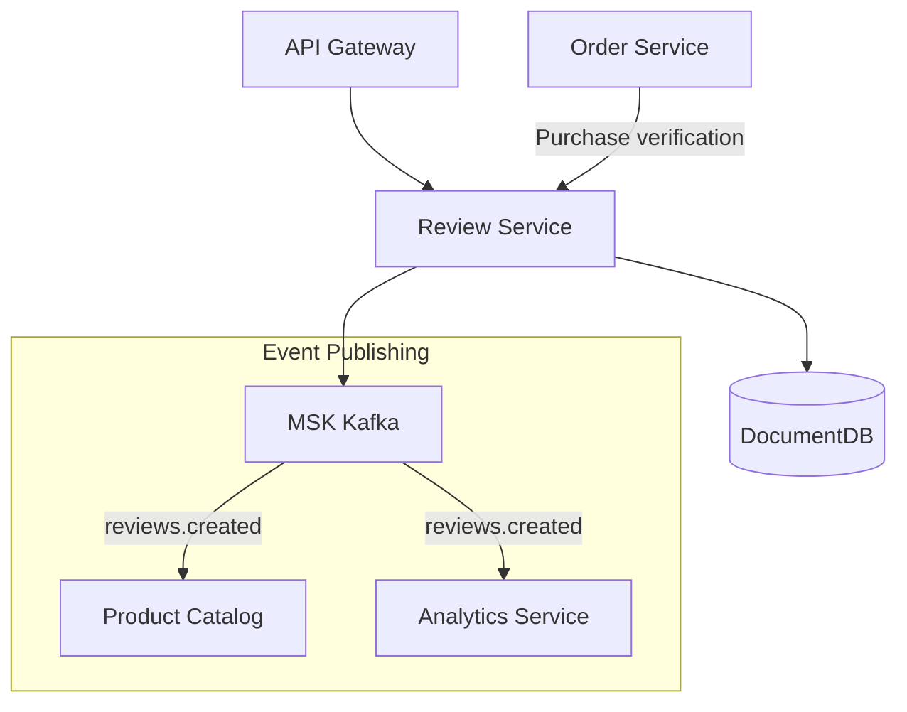
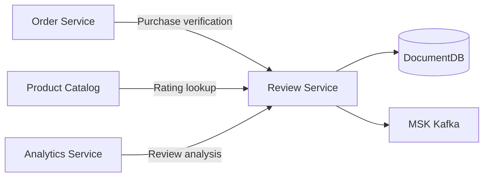

# Review Service

## Overview

The Review Service manages user reviews and ratings for products. It displays verified purchase reviews and provides rating aggregation per product.

| Item | Value |
|------|-------|
| Language | Python 3.11 |
| Framework | FastAPI |
| Database | DocumentDB (MongoDB compatible) |
| Namespace | `mall-services` |
| Port | 8000 |
| Health Check | `GET /health` |

## Architecture



## API Endpoints

### Review API

| Method | Path | Description |
|--------|------|-------------|
| `GET` | `/api/v1/reviews/product/{product_id}` | Get reviews by product |
| `GET` | `/api/v1/reviews/{review_id}` | Get review details |
| `POST` | `/api/v1/reviews` | Create review |
| `PUT` | `/api/v1/reviews/{review_id}` | Update review |
| `DELETE` | `/api/v1/reviews/{review_id}` | Delete review |

### Request/Response Examples

#### Get Reviews by Product

**Request:**
```http
GET /api/v1/reviews/product/prod_001?page=1&page_size=10
```

**Response:**
```json
{
  "reviews": [
    {
      "id": "rev_001",
      "user_id": "user_001",
      "product_id": "prod_001",
      "rating": 5,
      "title": "Really satisfied with this product",
      "body": "Fast delivery and great quality. The color matches the photos exactly. Highly recommend!",
      "helpful_count": 42,
      "verified_purchase": true,
      "created_at": "2024-01-15T10:00:00Z",
      "updated_at": "2024-01-15T10:00:00Z"
    },
    {
      "id": "rev_002",
      "user_id": "user_002",
      "product_id": "prod_001",
      "rating": 4,
      "title": "Good product but shipping was a bit slow",
      "body": "The product itself is satisfactory, but delivery came two days later than expected.",
      "helpful_count": 15,
      "verified_purchase": true,
      "created_at": "2024-01-14T15:30:00Z",
      "updated_at": "2024-01-14T15:30:00Z"
    }
  ],
  "total": 128,
  "page": 1,
  "page_size": 10,
  "has_more": true
}
```

#### Create Review

**Request:**
```http
POST /api/v1/reviews
Content-Type: application/json

{
  "user_id": "user_003",
  "product_id": "prod_001",
  "rating": 5,
  "title": "Best choice I made",
  "body": "Great quality for the price. Stylish and practical design. I plan to buy from this brand again.",
  "verified_purchase": true
}
```

**Response (201 Created):**
```json
{
  "id": "rev_003",
  "user_id": "user_003",
  "product_id": "prod_001",
  "rating": 5,
  "title": "Best choice I made",
  "body": "Great quality for the price. Stylish and practical design. I plan to buy from this brand again.",
  "helpful_count": 0,
  "verified_purchase": true,
  "created_at": "2024-01-15T11:00:00Z",
  "updated_at": "2024-01-15T11:00:00Z"
}
```

#### Update Review

**Request:**
```http
PUT /api/v1/reviews/rev_003
Content-Type: application/json

{
  "rating": 4,
  "title": "Good product but one minor issue",
  "body": "Overall satisfied, but noticed some discoloration after a month of use. Still decent for the price."
}
```

**Response:**
```json
{
  "id": "rev_003",
  "user_id": "user_003",
  "product_id": "prod_001",
  "rating": 4,
  "title": "Good product but one minor issue",
  "body": "Overall satisfied, but noticed some discoloration after a month of use. Still decent for the price.",
  "helpful_count": 0,
  "verified_purchase": true,
  "created_at": "2024-01-15T11:00:00Z",
  "updated_at": "2024-02-15T09:00:00Z"
}
```

## Data Models

### Review

```python
class Review(BaseModel):
    id: str = ""
    user_id: str
    product_id: str
    rating: int = Field(..., ge=1, le=5)  # 1-5 stars
    title: str
    body: str
    helpful_count: int = 0  # "Helpful" count
    verified_purchase: bool = False  # Purchase verified
    created_at: datetime
    updated_at: datetime
```

### ReviewCreate

```python
class ReviewCreate(BaseModel):
    user_id: str
    product_id: str
    rating: int = Field(..., ge=1, le=5)
    title: str = Field(..., min_length=1, max_length=200)
    body: str = Field(..., min_length=1, max_length=5000)
    verified_purchase: bool = False
```

### ReviewUpdate

```python
class ReviewUpdate(BaseModel):
    rating: Optional[int] = Field(None, ge=1, le=5)
    title: Optional[str] = Field(None, min_length=1, max_length=200)
    body: Optional[str] = Field(None, min_length=1, max_length=5000)
```

### ReviewListResponse

```python
class ReviewListResponse(BaseModel):
    reviews: list[Review]
    total: int
    page: int
    page_size: int
    has_more: bool
```

### MongoDB Collection Schema

```javascript
// reviews collection
{
  "_id": ObjectId("..."),
  "user_id": "user_001",
  "product_id": "prod_001",
  "rating": 5,
  "title": "Really satisfied with this product",
  "body": "Fast delivery and great quality...",
  "helpful_count": 42,
  "verified_purchase": true,
  "created_at": ISODate("2024-01-15T10:00:00Z"),
  "updated_at": ISODate("2024-01-15T10:00:00Z")
}

// Indexes
db.reviews.createIndex({ "product_id": 1, "created_at": -1 })
db.reviews.createIndex({ "user_id": 1 })
db.reviews.createIndex({ "rating": 1 })
```

## Events (Kafka)

### Published Topics

| Topic | Event | Description |
|-------|-------|-------------|
| `reviews.created` | Review created | Published when new review is written |
| `reviews.updated` | Review updated | Published when review content changes |
| `reviews.deleted` | Review deleted | Published when review is deleted |

### Event Payload Example

**reviews.created:**
```json
{
  "event_type": "review.created",
  "review_id": "rev_003",
  "product_id": "prod_001",
  "user_id": "user_003",
  "rating": 5,
  "timestamp": "2024-01-15T11:00:00Z"
}
```

### Event Usage

- **Product Catalog**: Update product average rating
- **Analytics Service**: Review trend analysis
- **Notification Service**: Notify sellers of new reviews

## Environment Variables

| Variable | Description | Default |
|----------|-------------|---------|
| `SERVICE_NAME` | Service name | `review` |
| `PORT` | Service port | `8080` |
| `AWS_REGION` | AWS region | `us-east-1` |
| `REGION_ROLE` | Region role (PRIMARY/SECONDARY) | `PRIMARY` |
| `DB_HOST` | Database host | `localhost` |
| `DB_PORT` | Database port | `27017` |
| `DB_NAME` | Database name | `reviews` |
| `DB_USER` | Database user | `mall` |
| `DB_PASSWORD` | Database password | - |
| `DOCUMENTDB_HOST` | DocumentDB host | `localhost` |
| `DOCUMENTDB_PORT` | DocumentDB port | `27017` |
| `KAFKA_BROKERS` | Kafka broker address | `localhost:9092` |
| `LOG_LEVEL` | Log level | `info` |

## Service Dependencies



### Services It Depends On
- **DocumentDB**: Review data storage
- **MSK Kafka**: Event publishing
- **Order Service**: Purchase verification (verified_purchase)

### Services That Depend On This
- **Product Catalog**: Display reviews on product detail pages
- **Analytics Service**: Review sentiment analysis, trend identification
- **Recommendation Service**: Improve recommendations based on reviews

## Feature Details

### Rating System
- 1-5 star scale
- Automatic average rating calculation per product
- Rating distribution histogram provided

### Verified Purchase Reviews
- Only users with actual purchase history get "Verified Purchase" badge
- Auto-verification through Order Service integration

### Review Sorting Options
- Most recent (default)
- Highest/Lowest rating
- Most helpful
