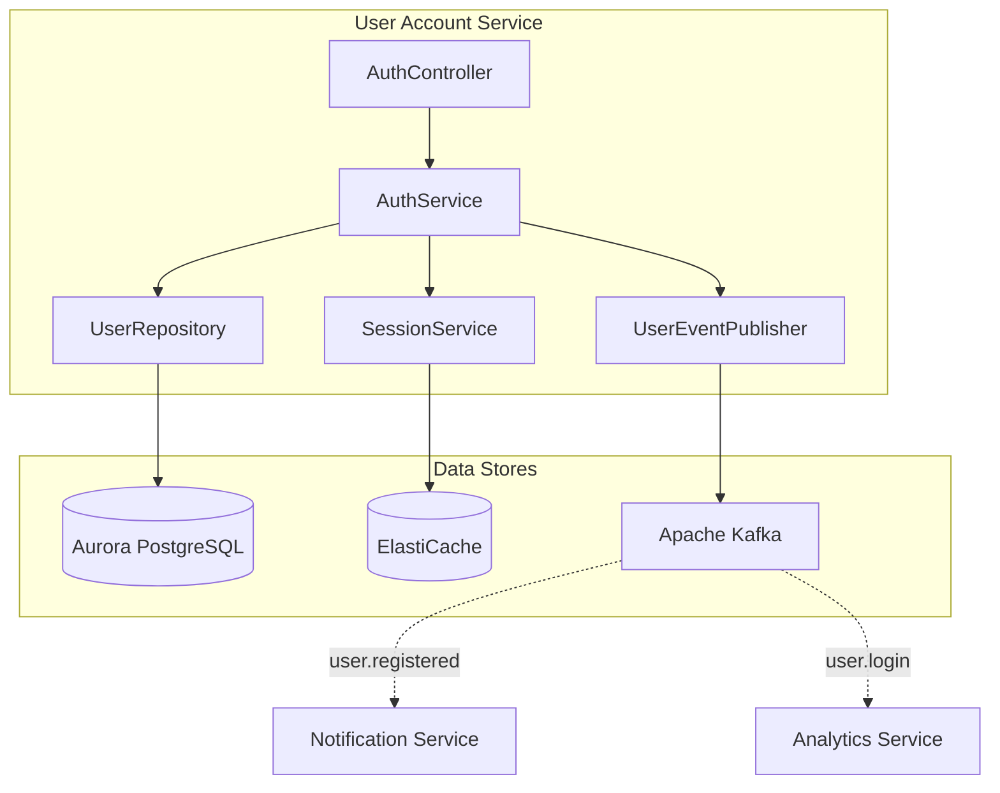
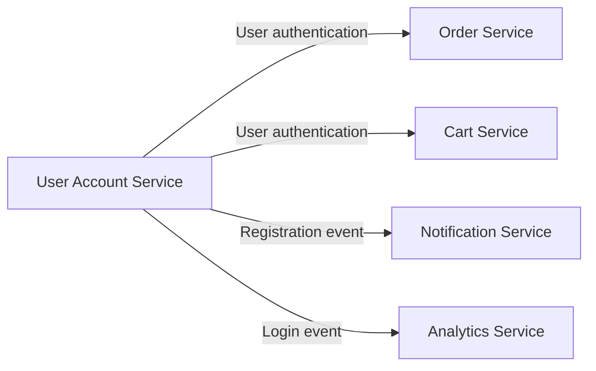
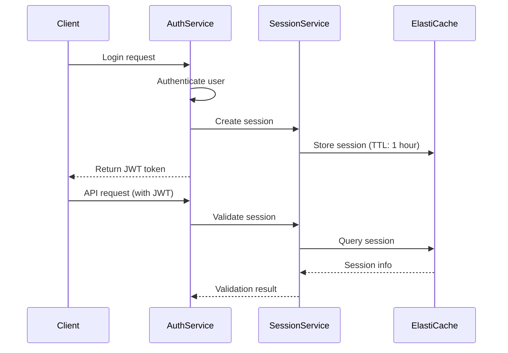

# User Account Service

## Overview

The User Account Service handles registration, login, logout, and other authentication/authorization features, providing JWT token-based authentication and session management using ElastiCache.

| Item | Details |
|------|---------|
| Language | Java 17 |
| Framework | Spring Boot 3.2 |
| Database | Aurora PostgreSQL (Global Database) |
| Cache | ElastiCache (Valkey/Redis) |
| Namespace | `mall-user-account` |
| Port | 8080 |
| Health Check | `/actuator/health` |

## Architecture



## API Endpoints

| Method | Path | Description | Auth Required |
|--------|------|-------------|---------------|
| `POST` | `/api/v1/auth/register` | Register | X |
| `POST` | `/api/v1/auth/login` | Login | X |
| `POST` | `/api/v1/auth/logout` | Logout | O |
| `GET` | `/api/v1/auth/me` | Get current user info | O |

### Register

**POST** `/api/v1/auth/register`

Request:
```json
{
  "email": "user@example.com",
  "password": "securePassword123",
  "name": "John Doe"
}
```

Validation:
- `email`: Required, email format
- `password`: Required, minimum 8 characters
- `name`: Required

Response (201 Created):
```json
{
  "id": "550e8400-e29b-41d4-a716-446655440000",
  "email": "user@example.com",
  "name": "John Doe",
  "role": "USER",
  "active": true,
  "createdAt": "2024-01-15T10:30:00Z"
}
```

### Login

**POST** `/api/v1/auth/login`

Request:
```json
{
  "email": "user@example.com",
  "password": "securePassword123"
}
```

Response (200 OK):
```json
{
  "token": "eyJhbGciOiJIUzI1NiIsInR5cCI6IkpXVCJ9...",
  "tokenType": "Bearer",
  "expiresIn": 3600,
  "user": {
    "id": "550e8400-e29b-41d4-a716-446655440000",
    "email": "user@example.com",
    "name": "John Doe",
    "role": "USER",
    "active": true,
    "createdAt": "2024-01-15T10:30:00Z"
  }
}
```

### Logout

**POST** `/api/v1/auth/logout`

Header:
```
Authorization: Bearer <token>
```

Response (204 No Content)

### Get Current User Info

**GET** `/api/v1/auth/me`

Header:
```
Authorization: Bearer <token>
```

Response (200 OK):
```json
{
  "id": "550e8400-e29b-41d4-a716-446655440000",
  "email": "user@example.com",
  "name": "John Doe",
  "role": "USER",
  "active": true,
  "createdAt": "2024-01-15T10:30:00Z"
}
```

## Data Models

### User Entity

```java
@Entity
@Table(name = "users")
public class User {
    public enum Role {
        USER, SELLER, ADMIN
    }

    @Id
    @GeneratedValue(strategy = GenerationType.UUID)
    private UUID id;

    @Column(unique = true, nullable = false)
    private String email;

    @Column(name = "password_hash", nullable = false)
    private String passwordHash;

    @Column(nullable = false)
    private String name;

    @Enumerated(EnumType.STRING)
    @Column(nullable = false)
    private Role role = Role.USER;

    @Column(nullable = false)
    private boolean active = true;

    @Column(name = "created_at", nullable = false, updatable = false)
    private Instant createdAt;

    @Column(name = "updated_at", nullable = false)
    private Instant updatedAt;
}
```

### User Roles

| Role | Description |
|------|-------------|
| `USER` | Regular user |
| `SELLER` | Seller |
| `ADMIN` | Administrator |

### Database Schema

```sql
CREATE TABLE users (
    id UUID PRIMARY KEY DEFAULT gen_random_uuid(),
    email VARCHAR(255) UNIQUE NOT NULL,
    password_hash VARCHAR(255) NOT NULL,
    name VARCHAR(255) NOT NULL,
    role VARCHAR(50) NOT NULL DEFAULT 'USER',
    active BOOLEAN NOT NULL DEFAULT true,
    created_at TIMESTAMP NOT NULL DEFAULT CURRENT_TIMESTAMP,
    updated_at TIMESTAMP NOT NULL DEFAULT CURRENT_TIMESTAMP
);

CREATE UNIQUE INDEX idx_users_email ON users(email);
CREATE INDEX idx_users_role ON users(role);
CREATE INDEX idx_users_active ON users(active);
```

## Events (Kafka)

### Published Topics

| Topic Name | Event | Description |
|------------|-------|-------------|
| `user.registered` | user.registered | Published on registration |
| `user.login` | user.login | Published on login |

#### user.registered Payload

```json
{
  "eventType": "user.registered",
  "userId": "550e8400-e29b-41d4-a716-446655440000",
  "email": "user@example.com",
  "name": "John Doe",
  "role": "USER",
  "timestamp": "2024-01-15T10:30:00Z"
}
```

#### user.login Payload

```json
{
  "eventType": "user.login",
  "userId": "550e8400-e29b-41d4-a716-446655440000",
  "email": "user@example.com",
  "timestamp": "2024-01-15T11:00:00Z"
}
```

## Environment Variables

| Variable | Description | Default |
|----------|-------------|---------|
| `SPRING_DATASOURCE_URL` | Aurora PostgreSQL connection URL | - |
| `SPRING_DATASOURCE_USERNAME` | DB username | - |
| `SPRING_DATASOURCE_PASSWORD` | DB password | - |
| `SPRING_REDIS_HOST` | ElastiCache host | - |
| `SPRING_REDIS_PORT` | ElastiCache port | 6379 |
| `SPRING_KAFKA_BOOTSTRAP_SERVERS` | Kafka broker address | - |
| `JWT_SECRET` | JWT signing secret | - |
| `JWT_EXPIRATION` | JWT expiration time (seconds) | 3600 |
| `SERVER_PORT` | Service port | 8080 |

## Service Dependencies



### Session Management

Session management using ElastiCache:



### Authentication Flow

1. **Registration**: Hash password and save, publish welcome email event
2. **Login**: Verify password, issue JWT token, store session
3. **Authenticated Request**: Verify JWT, check session
4. **Logout**: Delete session, invalidate token

### Security Settings

- Password: BCrypt hashing (strength 12)
- JWT: HMAC-SHA256 signature
- Session: ElastiCache TTL-based automatic expiration
- HTTPS: TLS 1.3 required

### Error Handling

| HTTP Status Code | Error | Description |
|------------------|-------|-------------|
| 400 | ValidationException | Input validation failure |
| 401 | UnauthorizedException | Authentication failure (invalid credentials) |
| 403 | ForbiddenException | Permission denied |
| 409 | DuplicateEmailException | Already registered email |
