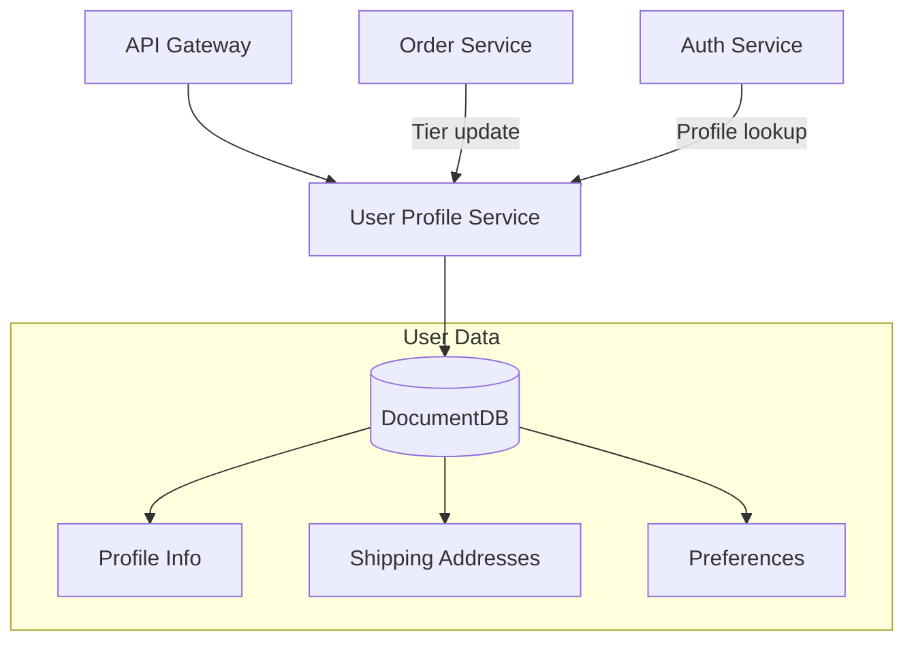
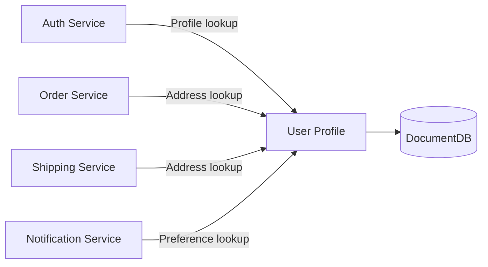

# User Profile Service

## Overview

The User Profile Service manages member personal information, shipping addresses, and preference settings. It provides differentiated benefits through a membership tier system (Bronze/Silver/Gold/Platinum).

| Item | Value |
|------|-------|
| Language | Python 3.11 |
| Framework | FastAPI |
| Database | DocumentDB (MongoDB compatible) |
| Namespace | `mall-services` |
| Port | 8000 |
| Health Check | `GET /health` |

## Architecture



## API Endpoints

### Profile API

| Method | Path | Description |
|--------|------|-------------|
| `GET` | `/api/v1/profiles/{user_id}` | Get profile |
| `PUT` | `/api/v1/profiles/{user_id}` | Update profile |
| `GET` | `/api/v1/profiles/{user_id}/addresses` | Get address list |
| `POST` | `/api/v1/profiles/{user_id}/addresses` | Add address |
| `PUT` | `/api/v1/profiles/{user_id}/addresses/{address_id}` | Update address |
| `DELETE` | `/api/v1/profiles/{user_id}/addresses/{address_id}` | Delete address |

### Request/Response Examples

#### Get Profile

**Request:**
```http
GET /api/v1/profiles/user_001
```

**Response:**
```json
{
  "user_id": "user_001",
  "phone": "010-1234-5678",
  "date_of_birth": "1990-05-15",
  "avatar_url": "https://cdn.example.com/avatars/user_001.jpg",
  "preferences": {
    "language": "ko",
    "currency": "KRW",
    "categories": ["electronics", "fashion"],
    "tier": "gold",
    "notification_email": true,
    "notification_push": true
  },
  "addresses": [
    {
      "id": "addr_001",
      "label": "Home",
      "street": "123 Gangnam-daero",
      "city": "Seoul",
      "state": "Seoul",
      "postal_code": "06000",
      "country": "KR",
      "is_default": true
    }
  ],
  "created_at": "2024-01-01T00:00:00Z",
  "updated_at": "2024-01-15T10:00:00Z"
}
```

#### Update Profile

**Request:**
```http
PUT /api/v1/profiles/user_001
Content-Type: application/json

{
  "phone": "010-9876-5432",
  "preferences": {
    "language": "ko",
    "currency": "KRW",
    "categories": ["electronics", "sports"],
    "notification_push": false
  }
}
```

**Response:**
```json
{
  "user_id": "user_001",
  "phone": "010-9876-5432",
  "date_of_birth": "1990-05-15",
  "avatar_url": "https://cdn.example.com/avatars/user_001.jpg",
  "preferences": {
    "language": "ko",
    "currency": "KRW",
    "categories": ["electronics", "sports"],
    "tier": "gold",
    "notification_email": true,
    "notification_push": false
  },
  "addresses": [],
  "created_at": "2024-01-01T00:00:00Z",
  "updated_at": "2024-01-15T11:00:00Z"
}
```

#### Add Address

**Request:**
```http
POST /api/v1/profiles/user_001/addresses
Content-Type: application/json

{
  "label": "Office",
  "street": "456 Teheran-ro",
  "city": "Seoul",
  "state": "Seoul",
  "postal_code": "06100",
  "country": "KR",
  "is_default": false
}
```

**Response (201 Created):**
```json
{
  "id": "addr_002",
  "label": "Office",
  "street": "456 Teheran-ro",
  "city": "Seoul",
  "state": "Seoul",
  "postal_code": "06100",
  "country": "KR",
  "is_default": false
}
```

## Data Models

### UserProfile

```python
class UserProfile(BaseModel):
    user_id: str
    phone: Optional[str] = None
    date_of_birth: Optional[str] = None
    avatar_url: Optional[str] = None
    preferences: dict = {}
    addresses: list[Address] = []
    created_at: datetime
    updated_at: datetime
```

### Address

```python
class Address(BaseModel):
    id: str
    label: str  # e.g., "Home", "Office", "Parents"
    street: str
    city: str
    state: str
    postal_code: str
    country: str = "KR"
    is_default: bool = False
```

### Membership Tier System

| Tier | Condition | Benefits |
|------|-----------|----------|
| **Bronze** | Default | 1% rewards rate |
| **Silver** | Cumulative purchases 500,000 KRW | 2% rewards rate, free shipping coupons |
| **Gold** | Cumulative purchases 2,000,000 KRW | 3% rewards rate, priority shipping |
| **Platinum** | Cumulative purchases 5,000,000 KRW | 5% rewards rate, VIP-exclusive products |

### Preferences

```json
{
  "language": "ko",           // Language: ko, en, ja, zh
  "currency": "KRW",          // Currency: KRW, USD, JPY
  "categories": ["electronics", "fashion"],  // Interests
  "tier": "gold",             // Membership tier
  "notification_email": true, // Email notifications
  "notification_push": true,  // Push notifications
  "notification_sms": false   // SMS notifications
}
```

## Events (Kafka)

### Published Topics

| Topic | Event | Description |
|-------|-------|-------------|
| `users.profile-updated` | Profile updated | Published when profile info changes |
| `users.address-added` | Address added | Published when new address is registered |
| `users.tier-changed` | Tier changed | Published when membership tier changes |

### Subscribed Topics

| Topic | Event | Description |
|-------|-------|-------------|
| `orders.completed` | Order completed | Aggregate purchase amount for tier calculation |

## Environment Variables

| Variable | Description | Default |
|----------|-------------|---------|
| `SERVICE_NAME` | Service name | `user-profile` |
| `PORT` | Service port | `8080` |
| `AWS_REGION` | AWS region | `us-east-1` |
| `REGION_ROLE` | Region role (PRIMARY/SECONDARY) | `PRIMARY` |
| `DB_HOST` | Database host | `localhost` |
| `DB_PORT` | Database port | `27017` |
| `DB_NAME` | Database name | `user_profiles` |
| `DB_USER` | Database user | `mall` |
| `DB_PASSWORD` | Database password | - |
| `DOCUMENTDB_HOST` | DocumentDB host | `localhost` |
| `DOCUMENTDB_PORT` | DocumentDB port | `27017` |
| `KAFKA_BROKERS` | Kafka broker address | `localhost:9092` |
| `LOG_LEVEL` | Log level | `info` |

## Service Dependencies



### Services It Depends On
- **DocumentDB**: Profile/address data storage

### Services That Depend On This
- **Auth Service**: Profile info lookup on login
- **Order Service**: Address selection during checkout
- **Shipping Service**: Shipping address verification
- **Notification Service**: Notification channel preference check
