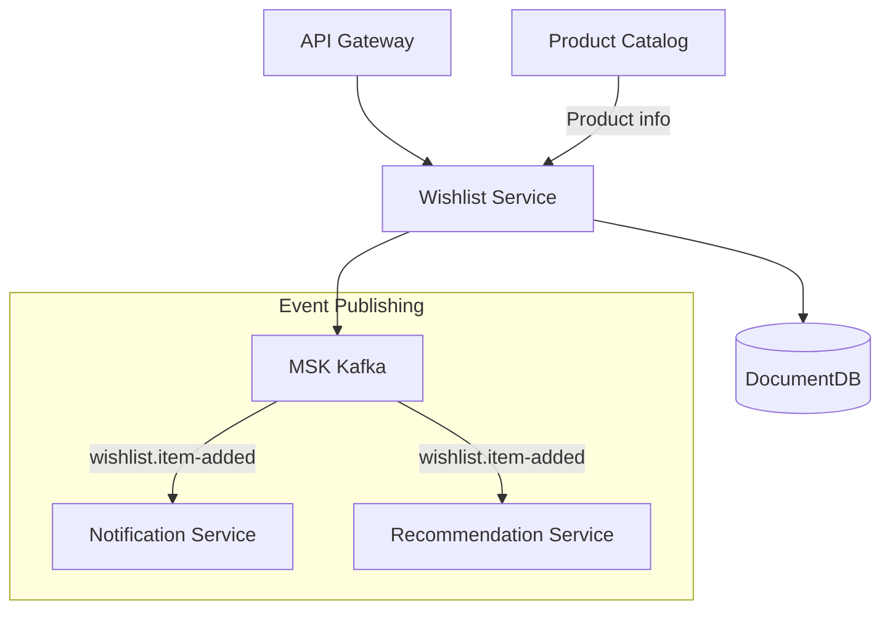
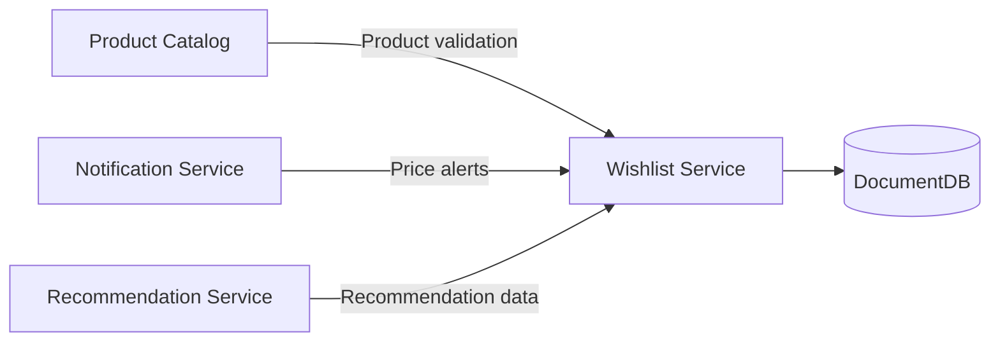

# Wishlist Service

## Overview

The Wishlist Service provides functionality for users to save and manage products they are interested in. Users can collect products they want to purchase later and receive notifications about price changes or restocking.

| Item | Value |
|------|-------|
| Language | Python 3.11 |
| Framework | FastAPI |
| Database | DocumentDB (MongoDB compatible) |
| Namespace | `mall-services` |
| Port | 8000 |
| Health Check | `GET /health` |

## Architecture



## API Endpoints

### Wishlist API

| Method | Path | Description |
|--------|------|-------------|
| `GET` | `/api/v1/wishlists/{user_id}` | Get wishlist |
| `POST` | `/api/v1/wishlists/{user_id}/items` | Add item |
| `DELETE` | `/api/v1/wishlists/{user_id}/items/{product_id}` | Remove item |

### Request/Response Examples

#### Get Wishlist

**Request:**
```http
GET /api/v1/wishlists/user_001
```

**Response:**
```json
{
  "user_id": "user_001",
  "items": [
    {
      "product_id": "prod_001",
      "added_at": "2024-01-15T10:00:00Z",
      "note": "Want to buy as a birthday gift"
    },
    {
      "product_id": "prod_002",
      "added_at": "2024-01-14T15:30:00Z",
      "note": null
    }
  ],
  "created_at": "2024-01-01T00:00:00Z",
  "updated_at": "2024-01-15T10:00:00Z"
}
```

#### Add Item

**Request:**
```http
POST /api/v1/wishlists/user_001/items
Content-Type: application/json

{
  "product_id": "prod_003",
  "note": "Planning to buy when on sale"
}
```

**Response (201 Created):**
```json
{
  "product_id": "prod_003",
  "added_at": "2024-01-15T11:00:00Z",
  "note": "Planning to buy when on sale"
}
```

#### Remove Item

**Request:**
```http
DELETE /api/v1/wishlists/user_001/items/prod_001
```

**Response (204 No Content)**

## Data Models

### Wishlist

```python
class Wishlist(BaseModel):
    user_id: str
    items: list[WishlistItem] = []
    created_at: datetime
    updated_at: datetime
```

### WishlistItem

```python
class WishlistItem(BaseModel):
    product_id: str
    added_at: datetime
    note: Optional[str] = None  # User note
```

### WishlistItemCreate

```python
class WishlistItemCreate(BaseModel):
    product_id: str
    note: Optional[str] = None
```

### MongoDB Collection Schema

```javascript
// wishlists collection
{
  "_id": ObjectId("..."),
  "user_id": "user_001",
  "items": [
    {
      "product_id": "prod_001",
      "added_at": ISODate("2024-01-15T10:00:00Z"),
      "note": "Birthday gift"
    }
  ],
  "created_at": ISODate("2024-01-01T00:00:00Z"),
  "updated_at": ISODate("2024-01-15T10:00:00Z")
}

// Indexes
db.wishlists.createIndex({ "user_id": 1 }, { unique: true })
db.wishlists.createIndex({ "items.product_id": 1 })
```

## Events (Kafka)

### Published Topics

| Topic | Event | Description |
|-------|-------|-------------|
| `wishlists.item-added` | Item added | Published when item is added to wishlist |
| `wishlists.item-removed` | Item removed | Published when item is removed from wishlist |

### Event Payload Example

**wishlists.item-added:**
```json
{
  "event_type": "wishlist.item-added",
  "user_id": "user_001",
  "product_id": "prod_003",
  "timestamp": "2024-01-15T11:00:00Z"
}
```

### Event Usage

- **Notification Service**: Send notifications for wishlisted product price drops/restocking
- **Recommendation Service**: Improve personalized recommendations based on wishlists
- **Analytics Service**: Analyze popular wishlisted products

## Environment Variables

| Variable | Description | Default |
|----------|-------------|---------|
| `SERVICE_NAME` | Service name | `wishlist` |
| `PORT` | Service port | `8080` |
| `AWS_REGION` | AWS region | `us-east-1` |
| `REGION_ROLE` | Region role (PRIMARY/SECONDARY) | `PRIMARY` |
| `DB_HOST` | Database host | `localhost` |
| `DB_PORT` | Database port | `27017` |
| `DB_NAME` | Database name | `wishlists` |
| `DB_USER` | Database user | `mall` |
| `DB_PASSWORD` | Database password | - |
| `DOCUMENTDB_HOST` | DocumentDB host | `localhost` |
| `DOCUMENTDB_PORT` | DocumentDB port | `27017` |
| `KAFKA_BROKERS` | Kafka broker address | `localhost:9092` |
| `LOG_LEVEL` | Log level | `info` |

## Service Dependencies



### Services It Depends On
- **DocumentDB**: Wishlist data storage
- **Product Catalog**: Product existence validation (optional)

### Services That Depend On This
- **Notification Service**: Wishlist product notifications
- **Recommendation Service**: User interest identification
- **Analytics Service**: Wishlist trend analysis

## Feature Details

### Wishlist Limits
- Maximum 100 products per user
- No duplicate products allowed
- Out-of-stock/deleted products retained (for notification purposes)

### Notification Integration
Notifications triggered for the following events on wishlisted products:
- Price drop (10% or more)
- Restocking
- Low stock (5 or fewer items)
